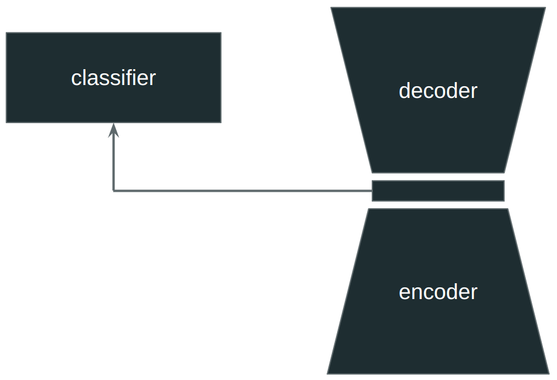

# Autoencoder with Classification Head

## config.yaml

**seed**

Randomness seed.

**trainer.max_epochs**

Number of epochs for training.

**model.encoder_layers**

A list of sizes for the encoder layers. The last layer size is the latent space size.

**model.decoder_layers**

A list of sizes for the decoder hidden layers. An additional layer is added automatically to match the input size.

**model.class_layers**

A list of sizes for the classifier hidden layers. An additional layer is added automatically to produce the classification output.

**model.activation.name**

The name of the nonlinearity to be used in all of the layers. This has to be a class name from *torch.nn*. 

**model.activation.init_args**

Arguments to be passed to the nonlinearity constructor.

**model.norm_layer.name**

The name of the normalization layer to be used. This can be either:
- none: no normalization layer
- instance: use InstanceNorm1d
- batch: use BatchNorm1d

**model.norm_layer.init_args**

Arguments to be passed to the Normalization layer constructor.

**model.dropout**

Dropout probability. Use 0 for no dropout.

**model.optimizer.name**

The name of the optimizer to be used. This has to be a class name from *torch.optim*.

**model.optimizer.init_args**

Arguments to be passed to the optimizer constructor.

**model.loss.class_weight**

Weight for the classification loss.

**model.loss.reconst_weight**

Weight for the reconstruction loss.

**model.loss.l1_weight**

Weight for the L1 penalty for the latent space.

**data.train_bsize**

Batch size for training.

**encode.bsize**

Batch size for encoding.